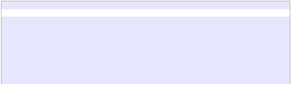

**CST8234 – C Programming** 

*DO NOT DISTRIBUTE - Copyright of Algonquin College* 

***Note: Students must demonstrate their lab to get the grade. This assignment is worth 40marks. A Missed demonstration will result in 100% grade deduction. You must talk to your lab instructor in advance in case of any unprecedented situation which may result in late submission/demonstration.*** 

**Assignment 1: Treasure Hunt Game** 

**Due Dates and Deliverables** 

- See the Brightspace Calendar and under **Activities** -> **Assignments**
- Upload **treasure\_hunt.zip** file to Brightspace containing makefile, .c and .h files 
- Weight: 10%

**Objective: To design and implement a dynamic memory-based Game** 

The objective of this lab assignment is to design and implement a dynamic memory-based treasure hunt game in C.  

**Purpose** 

- Practice programming with formatted input and output using printf() and scanf(). 
- Implement robust error handling for unexpected user input. 
- Utilize dynamic memory allocation and deallocation. 
- Gain experience with basic makefile support. 

**Procedure** 

In this lab, you will develop a C program that allows a user to dig for treasures hidden on a map represented by a dynamically allocated 2D array. The program must handle various user inputs and provide a menu-driven interface, making extensive use of arrays and pointers for effective memory management and data manipulation. 

**Program Requirements** 

1. **Dynamic Memory Allocation**: You will need to dynamically allocate memory for a 2D array representing the map using pointers. Do not use static arrays. This includes creating pointers for the rows and dynamically allocating memory for each column. ![ref1]
2. **Treasure Codes**: Each treasure code must start with 'T' followed by three digits (e.g., T001). You will need to validate that the codes meet this format and store them using an array of pointers. 
2. **Error Handling**: The program must handle 
   1. Invalid input for map dimensions and treasure codes 
   1. End-of-file (EOF) inputs 
   1. Memory allocation failures 
   1. Duplicate treasure codes 
2. **Map Dimensions**: The user will be prompted for the width and height of the map (between 2 and 32). 
2. **Game Features**:  
   1. Randomly generate treasure locations using pointers to manage the map data. 
   1. Allow users to dig at specified coordinates, using pointer arithmetic to access map elements. 
   1. Implement a menu with options to dig, exit the game, or enable cheat mode. 
2. **Map Display**: The map will show: 
- (blank) for areas not dug. 
- # for dug areas with no treasure. 
- $ for dug areas where treasure was found. 
- ! in cheat mode to indicate treasure locations. 
7. **Completion Message**: The game will notify the player when all treasures have been found. 

**Makefile Requirement:** The makefile must: 

- Compile your .c file with flags -ansi -pedantic -wall 
- Include a phony target run to compile and execute the program 
- Include a phony target clean to remove compilation files ![ref1]

**Example Output and Prompts** 

1) **Starting the Game and Game Map Display** 

|sbahr036@BAHRIS-NC08211:  /mnt/c/Users/bahris $ make run |
| - |
|./a01 |
|Enter Map Width: 12 |
|Enter Map Height: 4 |
|Enter number of treasures to add: 4 |
|Enter treasure #1 code (e.g. T001): T0011 |
|Treasure codes must be a ‘T’ followed by 3 digits. |
|Enter treasure #1 code (e.g. T001): t001 |
|Treasure codes must be a ‘T’ followed by 3 digits. |
||
|Enter treasure #1 code (e.g. T001): T001 |
|Enter treasure #2 code (e.g. T001): T002 |
|Enter treasure #3 code (e.g. T001): T003 |
|Enter treasure #4 code (e.g. T001): T002 |
|Treasure code already in use. |
|Enter treasure #4 code (e.g. T001): T004 |
||
||
|Map: |
|000000000011 |
|012345678901 |
|------------ |
|00|             |
|01|             |
|02|             |
|03|             |
||
2) **Menu Options:** 

|1 - Dig at a spot  | 2 - Exit Game      | 3 - Cheat! |
| - |
|-> 1 |
|Where would you like to dig? |
|x = 1 |
|y = 1 |
||
3) **Digging for Treasure:** 

Congratulations, you found a treasure! (code: T004) 1 - Dig at a spot  | 2 - Exit Game      | 3 - Cheat! -> 1 

Map: 

`   `000000000011 

`   `012345678901 

`   `------------ 

00|xx           

01|x$           

02|x            

03|x            ![ref1]

|Where would you like to dig? |
| - |
|x = 1 |
|y = 1 |
|You already found the treasure there! |

4) **Find Nothing:** 

|Where would you like to dig? |
| - |
|x = 2 |
|y = 2 |
|You found nothing there! |

5) **Enabling Cheat Mode:** 

|1 - Dig at a spot  | 2 - Exit Game      | 3 - Cheat! |
| - |
|-> 3 |
|CHEAT mode enabled! |
||
|Map: |
|000000000011 |
|012345678901 |
|------------ |
|00|xx!          |
|01|x$!         |
|02|xx           |
|03|x!           |

6) **Winning the Game: ![ref1]**

|Where would you like to dig? |
| - |
|x = 2 |
|y = 1 |
|Congratulations, you found all the treasures! |

**Marks Distribution** 

|**Criteria** |**Points** |
| - | - |
|
***Dynamic Memory Allocation:*** Proper allocation and deallocation of the 2D array using pointers. 

Effective use of dynamic memory management techniques 
|8 |
|
***Error Handling:*** Validating user input for map dimensions and treasure codes. 

Properly handling EOF inputs, memory allocation failures, and duplicate treasure codes 
|8 |
|***Treasure Code Validation:*** Correct implementation of checks for the treasure code format |7 |
|
***Game Features:*** Randomly generating treasure locations 

Implementing user interaction for digging at specified coordinates 

Managing and enabling cheat mode functionality 
|10 |
|***Map Display:*** Correct display of the map reflecting dug areas and treasure locations. Proper updates to the map based on user actions |5 |
|
***Makefile***: Creation of a functional makefile that compiles the program with specified flags. 

Inclusion of run and clean targets 
|2 |
|***Code Documentation and Style:*** Clear and concise code comments, including name, student ID, and function descriptions. Adherence to coding standards and conventions.*** |2 |
|**Total** |**40** |

**Notes** 

- All code must comply with the C90 standard. 
- Do not include stdbool.h 
- Pay attention to proper memory management to avoid leaks. 
- Use predefined values from header files (e.g., EXIT\_SUCCESS) and avoid magic numbers 
- Test your program using valgrind to check for memory issues. 
- Document your code with comments including your name, student ID, and function descriptions. ![ref1]

This assignment will help you practice using functions, dynamic memory, and arrays while reinforcing your understanding of error handling and conditionals in C programming. 

**Submit your work to Brightspace** 

Under Activities -> Assignments you will find Assignment 1. Upload the file treasure\_hunt.zip to submit your assignment 

- Make sure that you select the correct file!
- There may be multiple labs posted. Make sure that you submit into the correct Lab!

You will receive a confirmation email when your assignment is submitted. Always make sure that you receive this email and verify it carefully! 

This email is your proof that your assignment was submitted on time and lists the files you submitted. 

1. Verify the course name 
1. Verify the assignment name 
1. Verify the file name you submitted 
1. Verify the file size 

**Important Notes on Submissions** 

- We do not accept any assignment submissions by email. Always[ submit your work to Brightspace. ](file:///C:/Dell%20S%20Drive/DELL%20S%20Drive/Algonquin%20Terms'%20Data/C%20Programming%20Material/CST8234%20-%20C%20Language/Shavit/24W_CST8234_labs/lab2.html%23submit-your-work-to-brightspace)
- You can submit multiple times. The last submission will be graded. 
- No marks are awarded for submitting under the wrong assignment number or for sub-mitting the wrong file. 
- Plagiarism: All work must be original. Sharing or using unoriginal work will result in a grade of 0. ![ref1]
6 **|** P a g e** 

[ref1]: Aspose.Words.92eab717-300e-44b5-98d1-6abc4f9c7ef5.001.png
